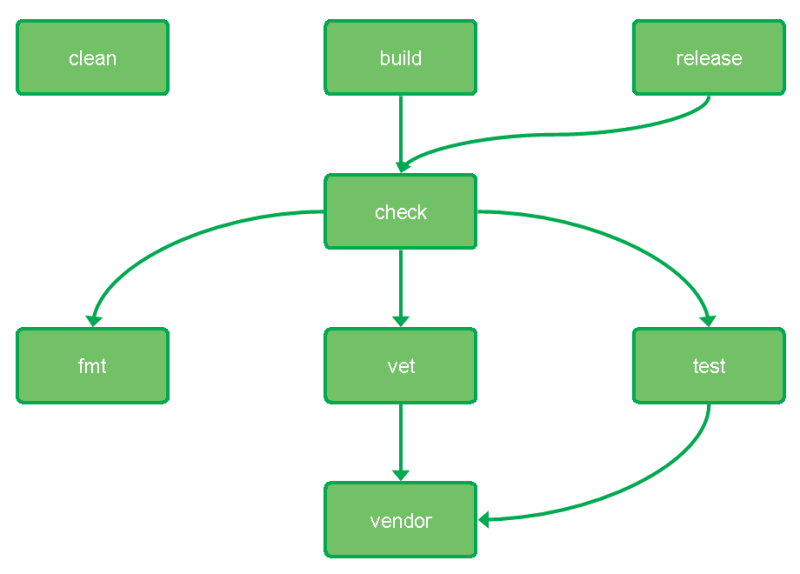

# Contributing to CloudSigma Driver

We ask that you read our contributing guidelines carefully so that you spend less time, overall,
struggling to push your PR through our code review processes.

At the same time, reading the contributing guidelines will give you a better idea of how to post
meaningful issues that will be more easily be parsed, considered, and resolved. A big win for
everyone involved!


## Table of Contents

A high level overview of our contributing guidelines.

- [Contributing Code](#contributing-code)
  - [Setting Up Your Development Environment](#setting-up-your-development-environment)
  - [Build Tasks](#build-tasks)
  - [Testing and Building](#testing-and-building)

Don't fret, it's not as daunting as the table of contents makes it out to be!


## Contributing Code

These guidelines will help you get your Pull Request into shape so that a code review can start
as soon as possible.

### Setting Up Your Development Environment

Fork, then clone the `https://github.com/cloudsigma/docker-machine-driver-cloudsigma` repo into
*$GOPATH/src/github.com/cloudsigma/docker-machine-driver-cloudsigma*.
This it important because of golang import path!

```bash
$ mkdir -p $GOPATH/src/github.com/cloudsigma/docker-machine-driver-cloudsigma
$ cd $GOPATH/src/github.com/cloudsigma/docker-machine-driver-cloudsigma
$ git clone https://github.com/cloudsigma/docker-machine-driver-cloudsigma .
# Change remote name from 'origin' to 'upstream'
$ git remote rename origin upstream
# Add remote with name 'origin' from your forked repo
$ git remote add origin git@github.com:<YOUR-GITHUB-USERNAME>/docker-machine-driver-cloudsigma.git
# Change remote for master branch
$ git config branch.master.remote origin
```

Now you can keep your forked repository up-to-date with the upstream repository with `git fetch upstream`
and push to your repository with `git push`. See [GitHub Help](https://help.github.com/articles/syncing-a-fork/)
for more details.

The project uses [Mage](https://magefile.org/) as build tool instead of make, so if you start working
 with our project, then **first install mage**:

```bash
$ go get -u github.com/magefile/mage
```

### Build Tasks

The project has predefined the following tasks:

```
build      Build binary for default local system's operating system and architecture.
check      Run all checks and tests.
clean      Delete the build directory.
fmt        Run gofmt linter.
release    Build release binaries for all supported versions.
test       Run all tests.
vendor     Install all dependencies into vendor directory.
vet        Run go vet linter.
```

Task dependencies can be seen on the picture below.


E.g. if you run `mage build`, then following tasks will be executed: `fmt -> vendor -> vet -> test -> build`.
Any customizations of the build process can be done in [Magefile.go](../Magefile.go).

### Testing and Building

To ensure that your changes will not break other functionality, please run the `check` task and
build process before submitting your Pull Request. You can do it, just run:

```bash
$ mage check
```

If you want to build docker driver binary file for testing purpose, just run:

```bash
$ mage build
```
